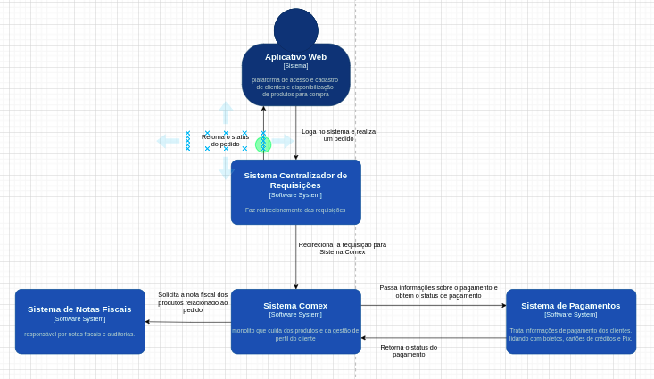
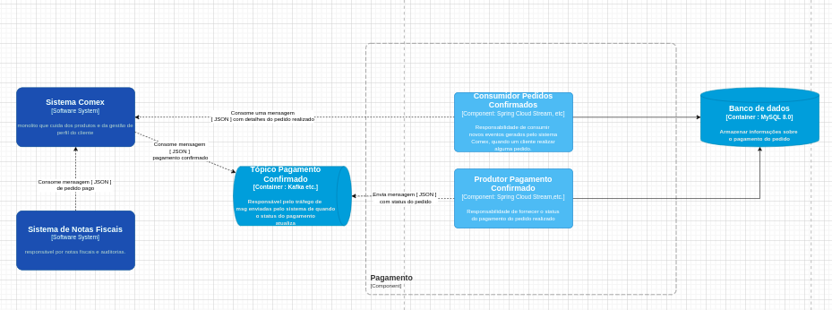
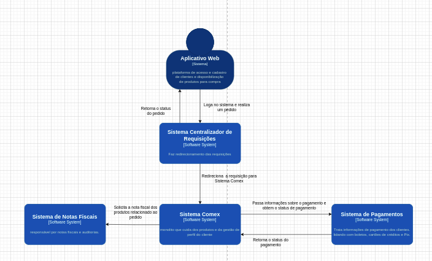

# Comex

<h2>Primeira Versão da Arquitetura</h2>

<h4>C4 - Context</h4>

<h4>C4 - Container (Pagamento)</h4>

<h4>C4 - Container (Comex)</h4>

<h4>C4 - Componente (Pagamento)</h4>

<h2>Arquitetura Final </h2>

<h4>C4 - Context</h4>

<h4>C4 - Container (Pagamento)</h4>

<h4>C4 - Container (Comex)</h4>

<h4>C4 - Componente (Pagamento)</h4>

<h4>C4 - Componente (Nota Fiscal)</h4>

